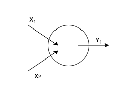

The term Neural Network has been used as a buzzword a lot more than anything else in the world of Computer Science, especially during the last couple decades. What is exactly it?

---

### The building block: Neuron

When it comes to understanding what an _Artificial Neural Network_ is, it is essential to start from its simplest form of building block, the artificial neurons. To get started, let's take a quick look at its sibling, the biological neuron.

##### Biological neuron

The biological neuron is the basic unit of the entire nervous system of animals. A simple animal like [Nematode](https://en.wikipedia.org/wiki/Nematode) has only 302 interconnected neurons which allows them to receive stimuli from the environments and respond to them accordingly. Those 302 neurons build up to 7,000 different neural connections in its nervous system, making it way more complicated that it sounds.

For the case of humans, we are a little bit more complicated with 100,000,000,000 neurons in our body mostly located in the [Central Nervous System (CNS)](https://en.wikipedia.org/wiki/Central_nervous_system) consisting of the brain and spinal cord. Furthermore, human has a bigger diversity in terms of the types of neurons it consists of. In our body, there is a vast array of neurons which can be classified as different from each others, some simple examples are [Unipolar neuron](https://en.wikipedia.org/wiki/Unipolar_neuron), [Bipolar neuron](https://en.wikipedia.org/wiki/Bipolar_neuron), and [Pseudounipolar neuron](https://en.wikipedia.org/wiki/Pseudounipolar_neuron). However, our neurons and those in Nematode are essentially made of the same components and follows the same structure/anatomy as what we'll be describing in the next couple of paragraphs.

The biological neuron anatomy. Source: Wikipedia.

Each component in a biological neuron has its own functions and specialities. Starting from the _cell body_ or _soma_ as the core of a neuron. The _cell body_ carries genetic information and acts as a main sources of energy which drives the entire neuron. It is made of some basic cell components such as _nucleus_ and _mitochondria_ just like any other types of cells.

_Dendrites_ is a tree-like structure branching out from and surrounding the _cell body_. Its main task is basically receiving signals from _axons_ of other neurons through a biological process called [neurotransmission](https://www.sciencedirect.com/topics/medicine-and-dentistry/neurotransmission). The signal will then be processed and sent to the next neurons though a long, tail-like structure named _axon_. Some _axons_ can be really long, and to expedite the transmission process, many _axons_ are wrapped and insulated by a fatty substance called the _myelin sheath_.

Interconnected neurons are basically one of the most important components of our nervous system as a whole. Neurons send/receive signals from/to each others using something called [action potentials](https://en.wikipedia.org/wiki/Action_potential). In brief, it is basically the change of neuron's electric potential triggered by the movement of ions within the neuron itself. This mechanism enables series of neurons to be able to send synapses and makes it possible for us human to perform basic activities such as moving our arms, smelling things, and whatnot.

##### Artificial neuron

After getting a little bit more familiar with what a biological neuron is and how it works, we can now discuss about the artificial neuron. Indeed, they are very similar in some senses. Both the biogical and artificial neurons have a layered architecture where each neuron (or we can mention it as node) are connected to the others, making up a giant network-like structure. Both neurons also share the same capability of taking up some input(s) and producing an output based on that input(s).

The artificial neuron is actually nothing fancy but an entity which **takes one or more inputs**, **apply some mathematical functions on the input data**, and **outputs the computational result of that function execution**.

Example of a 2-inputs neuron.

The common mathematical operations which will be implemented for a regular neuron are just as simple as multiplication and addition. Let's use our 2-inputs neuron as an example to make the explanations clearer. There are 3 majors steps that have to be done before coming up with the output.

First thing is basically to multiply each of the inputs with their corresponding weights like the following expression:

$$
x_{1} * w_{1}
$$

$$
x_{2} * w_{2}
$$

**NOTE** - Please be noted that $x_{1}$ and $x_{2}$ need not always be a scalar value. They can be vectors but the data structure of both $w_{1}$ and $w_{2}$ have to be adjusted accordingly as well.

After obtaining the products of each input and the weight associated with it, we will find the sum of these products and add them with a bias $b$.

$$
(x_{1} * w_{1}) + (x_{2} * w_{2}) + b
$$

Lastly, we'll take the value that we got from the previous step and feed it into a particular kind of [activation function](https://en.wikipedia.org/wiki/Activation_function) to get the output $y_{1}$.

$$
y_{1} = f((x_{1} * w_{1}) + (x_{2} * w_{2}) + b)
$$

### Neural network

### Activation functions

### Back propagation

### Conclusion

In conclusion, we have covered some fundamental concepts of _First-Class Functions_. You have seen some examples showing that JavaScript function is nothing but an instance of the built-in `Function` class.

We also have taken 2 different perspectives when discussing about the idea behind _Higher-Order Functions_, from both Mathematics and Computer Science point of views. They basically refer to the same concept with slightly different implementations.

Finally, we are all now must be familiar with some built-in JavaScript _Higher-Order Functions_ and their use cases through the code examples provided.

That's it, I hope you enjoy reading my post and thanks for coming by!
